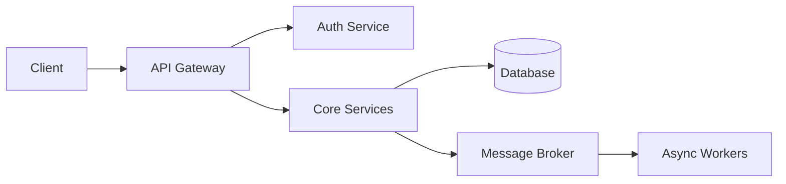

# 👋  Hello, I'm Ayomide

## 🚀 Software Engineer — Backend Focused
### ⚡ Building Scalable, Secure & High-Performance Systems

  

---

## 📋 Table of Contents

- [About Me](#-about-me)
- [What I Do](#-what-i-do)
- [Core Expertise](#-core-expertise)
- [Tech Stack](#️-tech-stack)
- [Architecture Mindset](#-architecture-mindset)
- [GitHub Stats](#-github-stats)
- [Current Focus](#-current-focus)
- [Connect With Me](#-connect-with-me)
- [Contribution Snake](#-contribution-snake)
- [Profile Views](#-profile-views)
- [Dev Quote](#-dev-quote)
- [Philosophy](#-philosophy)
- [Featured Projects](#-featured-projects)
- [Activity Graph](#-activity-graph)

---

## 🧠 About Me

I’m a backend engineer passionate about building **scalable**, **secure**, and **high-performance systems**.  
I focus on **clean architecture**, **distributed systems**, and **production-grade backend engineering**.

- 🔥 Backend-first engineer with strong system design thinking  
- ⚙️ Specialized in **microservices & event-driven architecture**  
- ☁️ Building **cloud-native and scalable systems**  
- 🧩 Focused on **performance, reliability, and maintainability**  

---

## 🔧 What I Do

- **Backend Development:** RESTful & event-driven APIs using Node.js, NestJS, Express  
- **System Architecture:** Microservices & distributed systems design  
- **Database Engineering:** PostgreSQL & MongoDB optimization  
- **Cloud & DevOps:** Docker, AWS, CI/CD pipelines  
- **Security:** JWT, OAuth2, RBAC authentication systems  

---

## ⚡ Core Expertise
✔ REST & Event-Driven APIs
✔ Microservices Architecture
✔ System Design & Scalability
✔ Authentication & Security
✔ Database Optimization
✔ Cloud Deployment & Containerization

---

## 🛠️ Tech Stack

  

---

## 🧱 Architecture Mindset

### What I'm Building
🏗️ Scalable backend systems (microservices)  
📡 Event-driven systems (Kafka / RabbitMQ)  
🔐 Secure authentication (JWT, OAuth2, RBAC)  
☁️ Cloud deployments (Docker + AWS)

---

## 📊 GitHub Stats

  
   
  
   
  
   
  

---

## 🧩 Current Focus

⚡ Advanced system design patterns  
🧠 Distributed systems & fault tolerance  
📈 Performance optimization & scaling  
🔄 CI/CD pipelines & DevOps workflows

---

## 🌐 Connect With Me

  
  
  
  

---

## 🐍 Contribution Snake

  

---

## 👀 Profile Views

  

---

## 💡 Dev Quote

  

---

## 🧠 Philosophy

> Good code works. Great systems scale.

---

## 🚀 Featured Projects

Here are some of my featured projects:

### [Project 1](https://github.com/Iamayomi/project1)
A scalable microservice for user authentication using NestJS and JWT.

### [Project 2](https://github.com/Iamayomi/project2)
Event-driven API with Kafka integration for real-time data processing.

*(Replace with your actual projects)*

---

## 📈 Activity Graph

  

---

If you want the **next level (this is what top engineers do)**, the real upgrade is:
- Add **featured projects with architecture diagrams**
- Include **live API links**
- Show **real metrics (latency, throughput, scale)**

Say *"upgrade to elite"* and I'll transform this into a **job-winning portfolio README**.

---

## 📝 License

This profile README is open source. Feel free to use it as inspiration for your own!

---

*Last updated: April 2026*
